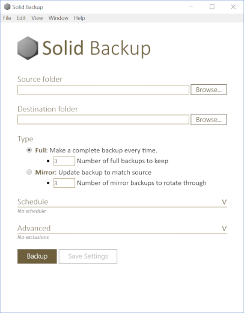

## Features
* **Back up everything you care about.** Choose any folder, including application settings. You can even back up files you currently have open.
* **Ask once.** Choose a schedule for backups. It's one less worry for you.
* **Avoid mistakes.** You've probably never tried to back up a folder to itself. I have. After doubling in size many times over, I quickly filled the hard disk with folders so deep Windows couldn't delete the bad backup. Unlike other available programs, Solid Backup prevents this from occuring.
* **Free** and open source. SolidBackup is licensed under the GPL v3.

## [Download](https://github.com/dbolton/SolidBackup/releases/latest)
1. Go to the [latest release](https://github.com/dbolton/SolidBackup/releases/latest) and choose the file that ends ".exe".
2. Open the .exe file to install the software. (The same installer works on x86 and x64 computers.)
3. If you get a message "Windows protected your PC," choose **More info**, then choose **Run anyway**. This message occurs for installers that are not signed. Unfortunately, code signing cost money and this software is not bringing in money. (This only occurs when Windows SmartScreen is active in Windows 8, 8.1, and 10, otherwise you will just get the standard administrative permission prompt.)
4. Choose **Yes** when Microsoft Windows asks "Do you want to allow this app from an unknown publisher to make changes to your device?" Solid Backup requires administrative permissions to access all folders and files on your drive of choice (this includes open files). Scheduling backups also requires administrative permission.

## Contribute
Do you want to improve Solid Backup? Awesome! Please see [Contributing](CONTRIBUTING.md).

Enjoy Solid Backup!
